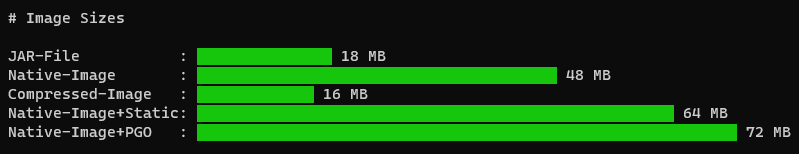
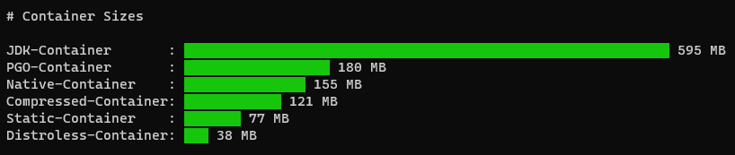
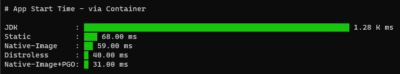

# Spring Boot / GraalVM REST Example

#### Prerequisites

Java 17 is used for this example, specifically GraalVM 22.3.0 Enterprise Edition and the `native-image` module. You can install GraalVM with native image support using a single line:

```
$ bash <(curl -sL https://get.graalvm.org/jdk)
```

More download info is [here](https://medium.com/p/91ee8d4e6ffd).

Spring Boot 3.0.0 with native support (which requires GraalVM 22.3.0).

Oracle Linux 9 `(x86_64)` was used as the underlying OS as some features are only available on `x86_64` platforms.

If you intend on creating containers, `docker` or `podman` is required. See docs [here](https://docs.oracle.com/en/operating-systems/oracle-linux/podman/podman-InstallingPodmanandRelatedUtilities.html#podman-install).

**Optional**

We'll use `termgraph` for visualizations in this example.  Since `termgraph` requires Python, it may be helpful to setup a Python virtual environment to install the necessary tools.

First, check your Python version (3.9 is recommended):

```
$ python3 --version
Python 3.9.7
```

Next, create a Python virtual environment:
 ```
 $ python3 -m venv demo-env
 ```

Activate the newly created virtual environment:
 ```
 $ source demo-env/bin/activate
 ```
 
With the virtual environment created, now install `termgraph`:
 ```
(demo-env) $ python3 -m pip install termgraph
 ```

>NOTE: If you are prompted to update `pip`, execute the following command:
 >```
 >$ python3 -m pip install --upgrade pip
 >```

Confirm `termgraph` installed correctly:
 ```
 $ termgraph
 usage: termgraph [-h] [--title TITLE] [--width WIDTH] [--format FORMAT] [--suffix SUFFIX] [--no-labels] [--no-values]
                 [--space-between] [--color [COLOR ...]] [--vertical] [--stacked] [--histogram] [--bins BINS]
                 [--different-scale] [--calendar] [--start-dt START_DT] [--custom-tick CUSTOM_TICK] [--delim DELIM]
                 [--verbose] [--label-before] [--version]
                 [filename]
```

Great, with all of the prerequisites in place, we can move to the next steps.

#### Building the Project

Let's begin by cloning the demo repository:

```
(demo-env) $ git clone https://github.com/swseighman/Spring-GraalVM-REST-Example
```
Now change directory to the new project:

```
(demo-env) $ cd Spring-GraalVM-REST-Example
```

To build the project, execute:
```
(demo-env) $ mvn clean package
```

The following command will run unit tests and enable the Tracing Agent, thus generating the Tracing Agent configuration for your application:

```
(demo-env) $ mvn -PnativeTest -DskipNativeTests=true -DskipNativeBuild=true -Dagent=true test
```

To verify the newly created Tracing Agent configuration, execute the following command.

```
(demo-env) $ ls -l target/native/agent-output/test
total 52
drwxrwxr-x 2 sseighma sseighma  4096 Oct 13 13:19 agent-extracted-predefined-classes
-rw-rw-r-- 1 sseighma sseighma   538 Oct 13 13:19 jni-config.json
-rw-rw-r-- 1 sseighma sseighma    64 Oct 13 13:19 predefined-classes-config.json
-rw-rw-r-- 1 sseighma sseighma   448 Oct 13 13:19 proxy-config.json
-rw-rw-r-- 1 sseighma sseighma 27389 Oct 13 13:19 reflect-config.json
-rw-rw-r-- 1 sseighma sseighma   773 Oct 13 13:19 resource-config.json
-rw-rw-r-- 1 sseighma sseighma    51 Oct 13 13:19 serialization-config.json
```

Next, build the native image executable using the configuration files. The `pom.xml` file contains configuration parameters *(via the Maven resources plugin)* to move the Tracing Agent configuration files from `target/native/agent-output/test` to the `/src/main/resources/META-INF/native-image` directory.

> NOTE: With the introduction of Spring 3.0, there is a new goal to trigger native image compilation, see more information on Spring 3.0 [here](https://docs.spring.io/spring-boot/docs/3.0.0/reference/html/native-image.html#native-image.developing-your-first-application.native-build-tools.maven).

```
(demo-env) $ mvn -Pnative native:compile -Dagent=true -DskipTests package
```

To run the native executable application, execute the following:

```
(demo-env) $ target/rest-service-demo
...<snip>
2022-04-04 11:27:58.076  INFO 27055 --- [           main] c.e.restservice.RestServiceApplication   : Started RestServiceApplication in 0.026 seconds (JVM running for 0.027)
```

#### Building a PGO Executable

You can optimize this native executable even more for additional performance gain and higher throughput by applying Profile-Guided Optimizations (PGO).

With PGO you can collect the profiling data in advance and then feed it to the `native-image` tool, which will use this information to optimize the performance of the resulting binary.

>**NOTE:** PGO is available with GraalVM Enterprise Edition only.

First, we'll build an instrumented native executable using the following command: 
```
(demo-env) $ mvn -Ppgo-inst -DskipTests package
```

>**NOTE:** If you encounter the following error:
>
>```
>Error: Main entry point class 'com.example.restservice.RestServiceApplication' neither found on the classpath nor on the modulepath.
>```
>
>comment out the following line in the `<configuration>` section:
>```
><mainClass>${exec.mainClass}</mainClass>
>```

Next, you'll need to run the newly created instrumented app to generate the profile information:

```
(demo-env) $  target/rest-service-demo-pgoinst
```

Finally, we'll build an optimized native executable (using the `pom.xml` profile to specify the path to the collected profile information):
```
(demo-env) $ mvn -Ppgo -DskipTests package
```


#### Building a Static Native Image (x64 Linux only)

See [instructions](https://docs.oracle.com/en/graalvm/enterprise/22/docs/reference-manual/native-image/guides/build-static-executables/) for building and installing the required libraries.

After the process has been completed, copy `$ZLIB_DIR/libz.a` to `$GRAALVM_HOME/lib/static/linux-amd64/musl/`

Also add `x86_64-linux-musl-native/bin/` to your PATH.

Then execute:
```
(demo-env) $ mvn -Pstatic -DskipTests package
```

To run the static native executable application, execute the following:
```
(demo-env) $ target/rest-service-demo-static
```


#### Container Options

Within this repository, there are a few examples of deploying applications in various container environments, from distroless to full OS images.  Choose the appropriate version for your use case and build the images.

>NOTE: Spring Boot includes support for Cloud Native Buildpacks to generate a lightweight container containing a native executable.  In this example, we'll build containers outside of the Buildpacks method.

For example, to build the JAR version:

```
(demo-env) $ podman build -f src/main/resources/containers/Dockerfile.jvm -t localhost/rest-service-demo:jvm .
```

```
(demo-env) $ podman run -i --rm -p 8080:8080 localhost/rest-service-demo:jvm
```

Browse to `localhost:8080/greeting`, where you should see:

```
{"id":1,"content":"Hello, World!"}
```

Or browse to `http://localhost:8080/greeting?name=User`

You should see:
```
{"id":12,"content":"Hello, User!"}
```


You can repeat these steps for each container option:

* Dockerfile.jvm
* Dockerfile.native
* Dockerfile.pgo
* Dockerfile.upx
* Dockerfile.stage
* Dockerfile.jlink
* Dockerfile.distroless
* Dockerfile.static (x64 Linux only)

There is also a `build-containers.sh` script provided to build the container images.

Notice the variation in container image size for each of the options:
```
(demo-env) $ podman images
localhost/rest-service-demo   upx            7d43ba8808df   23 hours ago    121MB
localhost/rest-service-demo   distroless     d09302740238   23 hours ago    37.2MB
localhost/rest-service-demo   native         18772054f07d   23 hours ago    154MB
localhost/rest-service-demo   pgo            bdbf1a188973   23 hours ago    179MB
localhost/rest-service-demo   jvm            e48787a8875a   23 hours ago    594MB
localhost/rest-service-demo   jlink          aabfde3c2c31   3 months ago    214MB
localhost/rest-service-demo   static         8bf6f43fd6cf   4 months ago    76.3MB
localhost/rest-service-demo   stage          428fdc2f55a0   4 months ago    177MB
```

To deploy all of the containers, run:
```
(demo-env) $ cd src/main/resources/containers
(demo-env) $ podman-compose up -d
[+] Running 7/7
 ⠿ Container rest-service-demo-distroless  Running                                                 0.0s
 ⠿ Container rest-service-demo-jvm         Running                                                 0.0s
 ⠿ Container rest-service-demo-native      Running                                                 0.0s
 ⠿ Container rest-service-demo-upx         Running                                                 0.0s
 ⠿ Container rest-service-demo-static      Running                                                 0.0s
 ⠿ Container rest-service-demo-pgo         Running                                                 0.0s
 ⠿ Container rest-service-demo-jlink       Started                                                 0.4s
```

>NOTE: You can install `podman-compose` using the instructions [here](https://github.com/containers/podman-compose).

```
(demo-env) $ podman ps
CONTAINER ID   IMAGE                                    COMMAND                  CREATED       STATUS       PORTS
       NAMES
5fef9e8aec02   localhost/rest-service-demo:jvm          "java -jar app.jar -…"   8 hours ago   Up 8 hours   0.0.0.0:8081->8080/tcp   rest-service-demo-jvm
907a0e4e9513   localhost/rest-service-demo:static       "/app -Xms64m -Xmx64m"   8 hours ago   Up 8 hours   0.0.0.0:8087->8080/tcp   rest-service-demo-static
959baabdf130   localhost/rest-service-demo:upx          "/app -Xms64m -Xmx64m"   8 hours ago   Up 8 hours   0.0.0.0:8083->8080/tcp   rest-service-demo-upx
54281b6e59d2   localhost/rest-service-demo:native       "/app -Xms64m -Xmx64m"   8 hours ago   Up 8 hours   0.0.0.0:8082->8080/tcp   rest-service-demo-native
a8e45684e8f3   localhost/rest-service-demo:pgo          "/app -Xms64m -Xmx64m"   8 hours ago   Up 8 hours   0.0.0.0:8086->8080/tcp   rest-service-demo-pgo
66e4f93d3dab   localhost/rest-service-demo:distroless   "/app -Xms64m -Xmx64m"   8 hours ago   Up 8 hours   0.0.0.0:8084->8080/tcp   rest-service-demo-distroless
```

To stop the containers, execute:

```
(demo-env) $ podman-compose down
```


#### Compressing the Native Image Executable

You can choose to compress the native image executable using the [upx](https://upx.github.io/) utility which will reduce your container size but have little impact on startup performance.

For example:

```
(demo-env) $ upx -7 -k target/rest-service-demo
Ultimate Packer for eXecutables
                          Copyright (C) 1996 - 2020
UPX 3.96        Markus Oberhumer, Laszlo Molnar & John Reiser   Jan 23rd 2020

        File size         Ratio      Format      Name
   --------------------   ------   -----------   -----------
  84541616 ->  26604004   31.47%   linux/amd64   rest-service-demo

Packed 1 file.
```
Using `upx` we reduced the native image executable size by ~33% (from **48 MB** to **16 MB**):
```
-rwxrwxr-x 1 sseighma sseighma  16M Oct 13 13:28 rest-service-demo
-rwxrwxr-x 1 sseighma sseighma  48M Oct 13 13:28 rest-service-demo.~
```

Our native image container is now **121 MB** (versus the uncompressed version at **154 MB**):

```
(demo-env) $ podman images
localhost/rest-service-demo   upx            7d43ba8808df   26 hours ago    121MB
localhost/rest-service-demo   native         18772054f07d   26 hours ago    154MB
```

#### Enabling JDK Flight Recorder

To build a native image with the JFR events support, you first need to enable JFR at image build time. The `pom.xml` includes parameters to build a native executable with JFR support enabled (in the `<buildArgs`):

```
    <buildArgs>
	<!-- Quick build mode is enabled  -->
	<buildArg>-Ob</buildArg>
	<!-- G1 is supported on Linux only, comment out next line if on another platform -->
	<buildArg>--gc=G1</buildArg>
	<!-- Enable JFR support -->
	<buildArg>--enable-monitoring=jfr</buildArg>
	<!-- Show exception stack traces for exceptions during image building -->
	<buildArg>-H:+ReportExceptionStackTraces</buildArg>
    </buildArgs>
```
					
After building the native executable, to enable JFR and start a recording, execute the following command:
```
(demo-env) $ target/rest-service-demo -XX:+FlightRecorder -XX:StartFlightRecording="filename=recording.jfr"
```
You will notice a `recording.jfr` file in the project root directory.  You can import this file into JDK Mission Control or view events via the command line. See more info [here](https://docs.oracle.com/en/java/java-components/jdk-mission-control/8/user-guide/using-jdk-flight-recorder.html#GUID-D38849B6-61C7-4ED6-A395-EA4BC32A9FD6).


Currently, JFR support includes these limitations:
* JFR events recording is not supported on GraalVM distribution for Windows.

See the [docs](https://docs.oracle.com/en/graalvm/enterprise/22/docs/reference-manual/native-image/debugging-and-diagnostics/JFR/) for additional information.


#### Viewing Project Metrics

If you're curious about image and container sizes or want to see the startup times for the containers created in this example, there are scripts located in the `src/main/resources/scripts` directory that create bar graphs for each.

To compare images sizes, run the `image-sizes.sh` script:



To compare container sizes, run the `container-sizes.sh` script:



To compare startup times, run the `startups.sh` script:



The graphs are generated using  the `termgraph` tool we installed earlier.